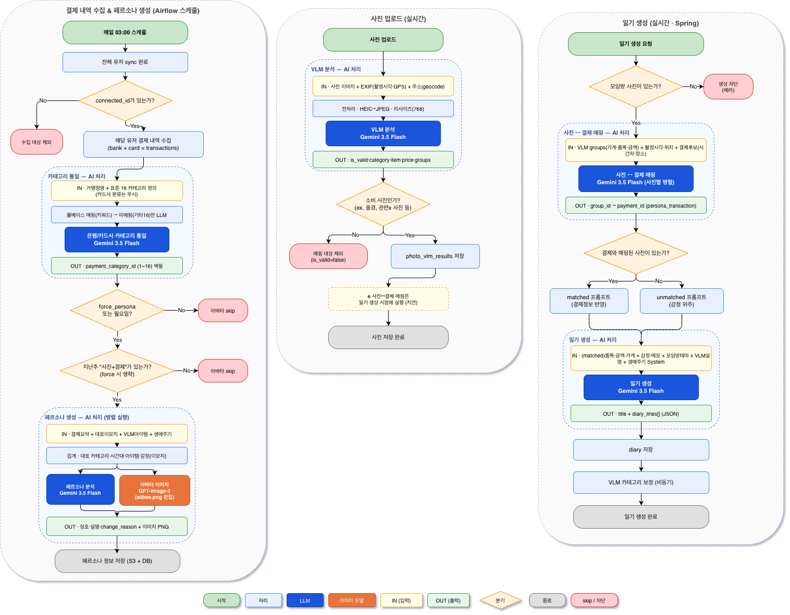

# [우리FISA 6기] AI 엔지니어링 과정 5팀 

## 1\. 프로젝트 개요
  * **주제** : (선택하신 프로젝트 주제를 작성해 주세요.)
  * **프로젝트 기획 배경** : (프로젝트의 기획 배경을 작성해 주세요.)
  * **기술 스택** : (어떤 기술 스택을 활용하여 프로젝트를 진행했는지 작성해 주세요.)
   
        
## 2\. 아키텍쳐

### 2-1. 시스템 아키텍쳐
(다이어그램, 도식화 등을 활용하여 시스템의 구성을 확인할 수 있는 이미지를 첨부해 주세요.)

### 설명
(첨부한 시스템 아키텍처 이미지를 간략하게 설명해 주세요.)

### 2-2. AI 에이전트 워크플로우 (AI 엔지니어링 과정만 해당)


### 설명
AI 에이전트 워크플로우는 3개의 파이프라인으로 구성됩니다.

**1) 결제 내역 수집 & 페르소나 생성 (Airflow, 매일 03:00)**
유저별 결제 내역을 수집해 LLM으로 카테고리를 통일하고, 주 1회 사진·결제 데이터가 있는 유저를 대상으로 LLM 분석(페르소나)과 이미지 생성(아바타)을 수행해 저장합니다.

**2) 사진 업로드 (실시간)**
업로드된 사진을 전처리(EXIF·리사이즈)한 뒤 VLM으로 카테고리·품목·가격을 추출하고, 소비와 무관한 사진은 제외한 뒤 결과를 저장합니다. 결제와의 매핑은 일기 생성 시점으로 지연됩니다.

**3) 일기 생성 (실시간, Spring 트리거)**
사진 그룹과 결제 후보를 LLM으로 매핑한 뒤, 매핑 여부에 따라 다른 프롬프트로 LLM이 일기(제목+본문)를 생성·저장합니다.

## 3\. 주요 기능 소개


### 3-1. 핵심 기술 구성


### 3-2. 통합 워크플로우 다이어그램


### 3-3. 세부 기능 소개

#### [기능1. 개인별 페르소나 생성]
  - 기능 설명 : 최근 결제 내역, 사진(VLM) 분석 결과, 감정 이모지를 기반으로 소비 패턴을 추출하고, LLM으로 캐릭터 페르소나를 생성한 뒤 이미지 모델로 아바타를 만듭니다.
  - 핵심 코드(스크립트) :
```python
def _extract_persona_elements(transactions, vlm_items, emoji) -> dict:
    top_category = max(category_spend, key=lambda k: category_spend[k]) if category_spend else "기타"
    dominant_slot = max(slot_count, key=lambda k: slot_count[k]) if slot_count else "심야"
    return {"top_category": top_category, "dominant_slot": dominant_slot,
            "props_hint": _get_props_hint(top_category), "emoji": emoji or "😊"}

async def _analyze_persona(summary, emoji_input, top_category, dominant_slot, ...):
    response = await client.aio.models.generate_content(
        model="gemini-3.5-flash", contents=prompt,
        config=genai_types.GenerateContentConfig(response_mime_type="application/json"),
    )
    return json.loads(text)
```
  - 코드 링크(스크립트 링크) : `backend/fastapi/app/services/avatar_service.py`

#### [기능2. 생애주기 예측]
  - 기능 설명 : LightGBM 모델로 카테고리별 지출 비율을 학습해 생애주기를 예측하고, 결제 장소·시간대·나이 정보로 확률을 보정합니다.
  - 핵심 코드(스크립트) :
```python
def predict_from_transactions(self, user_transactions: list, age: int = 0) -> dict:
    features = self.transactions_to_features(user_transactions)
    X = pd.DataFrame([[features.get(c, 0) for c in FEATURE_COLS]], columns=FEATURE_COLS)
    proba = self.pipeline.predict_proba(X)[0]
    proba = self._apply_keyword_boost(proba, places, categories)
    proba = self._apply_time_boost(proba, times)
    proba = self._apply_age_suppress(proba, age)
    pred_label = self.le.inverse_transform([np.argmax(proba)])[0]
    return {"lifecycle_code": pred_label, "confidence": round(float(proba.max()), 3), "top3_candidates": top3}
```
  - 코드 링크(스크립트 링크) : `backend/fastapi/ml/lifecycle_model.py`

#### [기능3. VLM 사진-결제 매핑]
  - 기능 설명 : 업로드된 사진을 VLM으로 분석해 소비 정보를 추출하고, 결제 후보와 시간·위치·가게명을 비교해 LLM이 1:1로 매칭합니다.
  - 핵심 코드(스크립트) :
```python
@router.post("/match", response_model=List[MappingResponse])
def match_photo_to_transaction(req: MappingRequest):
    for group in req.groups:
        prompt = get_prompt("group_mapping").format(group_id=group.group_id, store=group.store, ...)
        response = client.models.generate_content(
            model="gemini-3.5-flash", contents=prompt,
            config=types.GenerateContentConfig(response_mime_type="application/json"),
        )
        data = json.loads(content)
        payment_id = data.get("payment_id")
```
  - 코드 링크(스크립트 링크) : `backend/fastapi/app/api/vlm.py`, `backend/fastapi/app/api/mapping.py`

#### [기능4. LLM 소비 일기 생성]
  - 기능 설명 : 매핑된 결제·사진·감정 정보를 조합해 LLM으로 소비 일기를 자동 생성합니다.
  - 핵심 코드(스크립트) :
```python
async def generate_diary(req: DiaryRequest) -> DiaryResponse:
    system_content = get_system_prompt(req.life_stage_code).format(line_guide=_get_line_guide(req.photo_count or 1))
    user_content = get_prompt("diary_user_matched" if req.matched else "diary_user_unmatched").format(...)
    response = await asyncio.get_event_loop().run_in_executor(None, lambda: client.models.generate_content(
        model="gemini-2.5-flash", contents=user_content,
        config=types.GenerateContentConfig(temperature=0.75, response_mime_type="application/json",
                                            system_instruction=system_content),
    ))
    data = json.loads(content)
    return DiaryResponse(title=data["title"], diary_lines=data["diary_lines"], tags=req.tags or [])
```
  - 코드 링크(스크립트 링크) : `backend/fastapi/app/api/diary_generate.py`

#### [기능5. 맞춤 금융 상품 검색]
  - 기능 설명 : 자연어 검색어를 LLM으로 파싱해 조건을 추출하고, Elasticsearch 검색 결과와 병합·필터링하여 맞춤 금융 상품을 추천합니다.
  - 핵심 코드(스크립트) :
```java
@Cacheable(value = "searchCache", key = "#request.search_input.trim().toLowerCase()")
public SearchResponseDto search(SearchRequestDto request) {
    CompletableFuture<ParsedSearchDto> parseFuture = CompletableFuture.supplyAsync(() -> callParseSearch(keyword));
    CompletableFuture<SearchResultDto> searchFuture = CompletableFuture.supplyAsync(() -> productSearchService.search(keyword));
    CompletableFuture.allOf(parseFuture, searchFuture).join();
    if (parsed != null) products = applyGptFilter(products, parsed);
    return SearchResponseDto.builder().AI_text(aiText).products(products).matched_cate_names(matchedCateNames).build();
}
```
  - 코드 링크(스크립트 링크) : `backend/spring/src/main/java/com/sobee/sobee/domain/product/service/SearchService.java`, `backend/fastapi/app/services/search_parse_service.py`