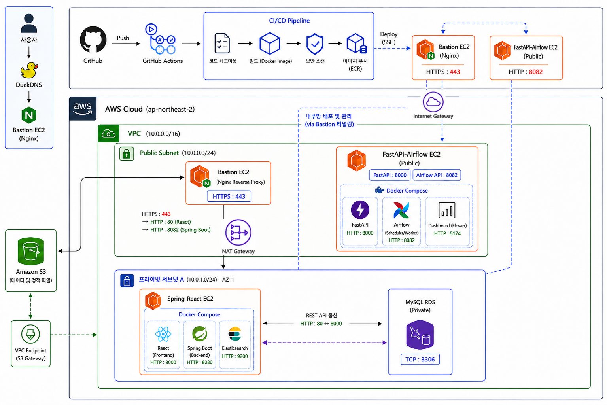
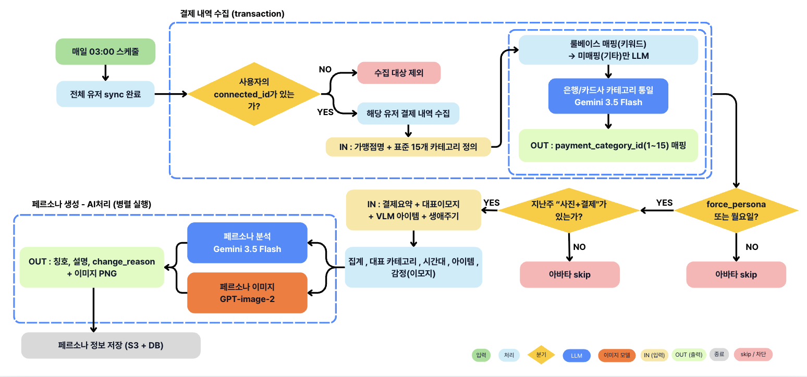
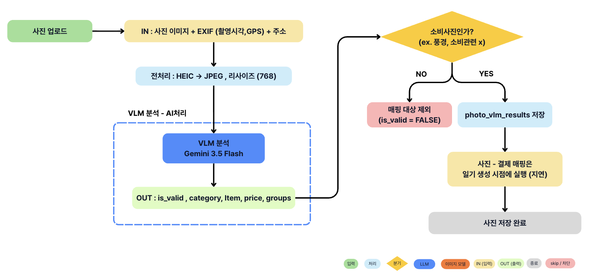
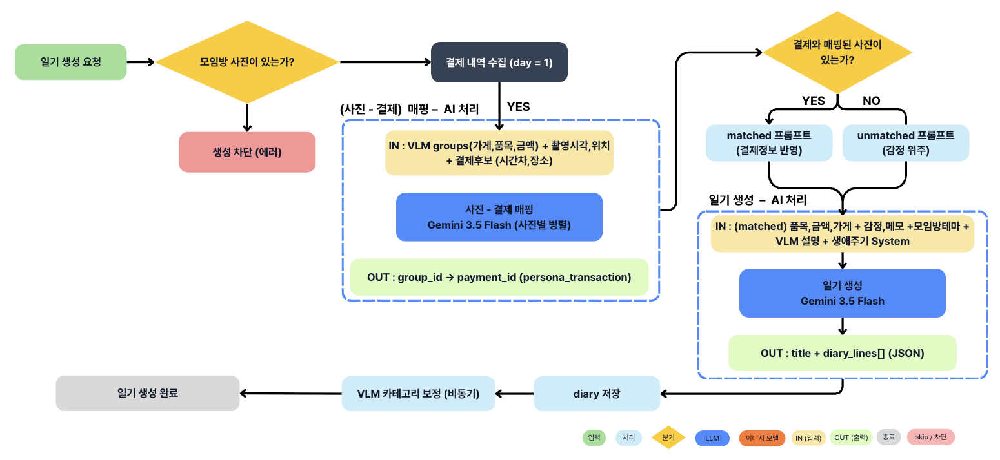
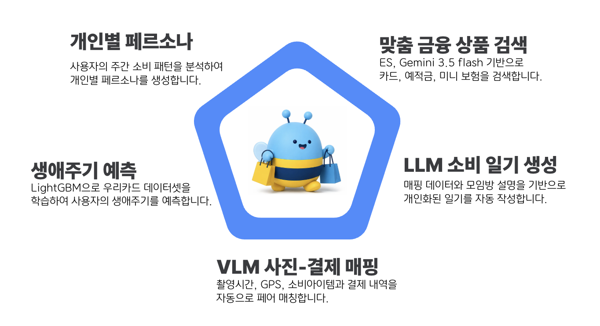
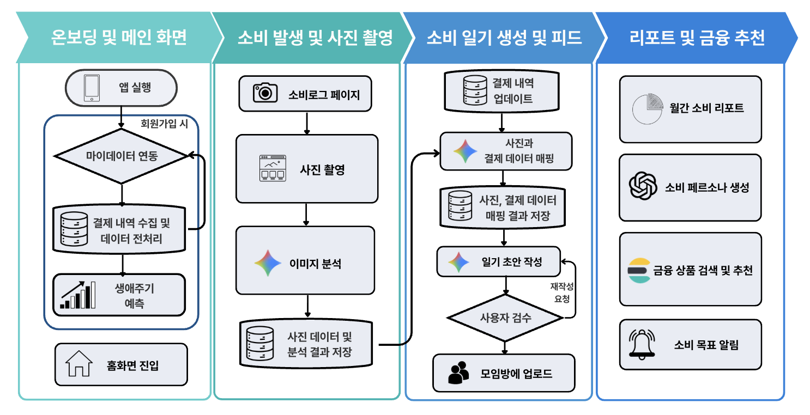

# [우리FISA 6기] AI 엔지니어링 과정 5팀 

## 1\. 프로젝트 개요
  * **주제** : 결제•이미지 데이터 기반 페르소나 도출 및 LLM 맞춤 금융 상품 제안•소비 일기 제공
  * **프로젝트 기획 배경** :  
    - 기존 금융 앱은 결제 내역을 단순 통계로만 보여줘 사용자가 자신의 소비 패턴과 생애주기를 직관적으로 파악하기 어렵습니다.  
    - 이를 해결하기 위해 결제·사진 데이터를 기반으로 개인화된 페르소나와 소비 일기를 생성하고, 이를 바탕으로 맞춤 금융 상품까지 제안하는 서비스를 기획했습니다.
  * **기술 스택** :
    - **Frontend** : React, React Router
    - **Backend** : FastAPI, Airflow, Spring
    - **AI / ML** : Gemini 3.5 Flash, GPT-image-2, LightGBM
    - **Infra / DB** : AWS S3, RDS(MySQL), Elasticsearch, GitHub
   
        
## 2\. 아키텍쳐

### 2-1. 시스템 아키텍쳐


### 설명
AWS Cloud(ap-northeast-2) 위에 VPC를 구성하여 퍼블릭/프라이빗 서브넷으로 역할을 분리했습니다.

- **CI/CD** : GitHub에 Push하면 GitHub Actions가 Docker 이미지 빌드 → 보안 스캔 → ECR 푸시까지 자동 수행하고, SSH를 통해 EC2에 배포합니다.
- **퍼블릭 서브넷** : Bastion EC2(Nginx Reverse Proxy)가 HTTPS(443)로 외부 요청을 받아 React(80)·Spring Boot(8082)로 라우팅합니다. FastAPI-Airflow EC2는 FastAPI(8000)·Airflow(8082)·Dashboard(5174)를 Docker Compose로 실행합니다.
- **프라이빗 서브넷** : Spring-React EC2에서 React(3000)·Spring Boot(8080)·Elasticsearch(9200)를 Docker Compose로 운영하며, MySQL RDS(3306)와 REST API로 통신합니다.
- **스토리지** : Amazon S3는 VPC Endpoint(S3 Gateway)를 통해 내부에서 직접 접근하여 데이터 및 정책 파일을 저장합니다.

### 2-2. AI 에이전트 워크플로우 (AI 엔지니어링 과정만 해당)




### 설명
AI 에이전트 워크플로우는 3개의 파이프라인으로 구성됩니다.

**1) 결제 내역 수집 & 페르소나 생성 (Airflow, 매일 03:00)**
유저별 결제 내역을 수집해 LLM으로 카테고리를 통일하고, 주 1회 사진·결제 데이터가 있는 유저를 대상으로 LLM 분석(페르소나)과 이미지 생성(아바타)을 수행해 저장합니다.

**2) 사진 업로드 (실시간)**
업로드된 사진은 EXIF 추출 및 리사이징한 뒤 VLM으로 카테고리·품목·가격을 추출합니다. 이때 소비와 무관한 사진(풍경, 자연 등)은 is_valid=0으로 표시하여 매핑 후보군에서 제외하고, 이후 매핑 정확도 저하나 불필요한 매핑 API 호출을 방지합니다. 결제 내역과의 실제 매핑은 일기 생성 시점에 일괄 처리됩니다.

**3) 일기 생성 (실시간, Spring 트리거)**
사진 그룹과 결제 후보를 LLM으로 매핑한 뒤, 매핑 여부에 따라 다른 프롬프트로 LLM이 일기(제목+본문)를 생성·저장합니다.

## 3\. 주요 기능 소개


### 3-1. 핵심 기술 구성


### 3-2. 통합 워크플로우 다이어그램


### 3-3. 세부 기능 소개

#### [기능1. 개인별 페르소나 생성]
  - 기능 설명 : 최근 결제 내역, 사진(VLM) 분석 결과, 감정 이모지를 기반으로 소비 패턴(대표 카테고리·활동 시간대·소비 아이템)을 추출하고, 이를 입력으로 LLM 페르소나 분석(칭호·설명)과 이미지 아바타 생성을 병렬로 수행합니다.
  - 핵심 코드(스크립트) :
```python
async def _generate_and_save_avatar(user_id, start_date, end_date) -> AvatarResponse:
    # 1. DB 병렬 조회 (결제내역·VLM매핑·감정사진·생애주기)
    transactions, mapped, photo_emotions, life_stage = await asyncio.gather(
        get_transactions_by_date_range(user_id, start_date, end_date),
        get_mapped_transactions_with_vlm(user_id, start_date, end_date),
        get_photo_emotions_by_payment_date(user_id, start_date, end_date),
        get_user_life_stage(user_id),
    )

    # 2. VLM 아이템 + 대표 감정 이모지 추출
    vlm_items = list(dict.fromkeys(r["vlm_item_name"] for r in mapped if r.get("vlm_item_name")))
    emoji = MOOD_NAME_TO_EMOJI.get(pick_top_mood_name(photo_emotions))

    # 3. 소비 패턴 추출 → 이미지 프롬프트 직접 조립
    elements = _extract_persona_elements(transactions, vlm_items, emoji or "")
    top_items = " & ".join(vlm_items[:2]) if vlm_items else elements["top_category"]
    image_prompt = get_prompt("avatar_image").format(top_items=top_items, **elements)

    # 4. LLM 페르소나 분석 + 이미지 생성 '병렬' 실행
    analysis, image_bytes = await asyncio.gather(
        _analyze_persona(summary, emoji, top_category, dominant_slot, top_items, ...),
        _generate_image(image_prompt),
    )

    # 5. S3 업로드 + DB 저장 후 응답 반환
    avatar_image_url = _upload_to_s3(image_bytes, user_id)
    await update_user_avatar(user_id, analysis["title"], analysis["description"], avatar_image_url, ...)
    return AvatarResponse(avatar_title=analysis["title"], avatar_image=avatar_image_url, ...)
```
  - 코드 링크(스크립트 링크) : https://github.com/SoBee-Logs/project/blob/develop/backend/fastapi/app/services/avatar_service.py

#### [기능2. 생애주기 예측]
  - 기능 설명 : LightGBM 모델로 카테고리별 지출 비율을 학습해 생애주기를 예측하고, 결제 장소·시간대·나이 정보로 확률을 보정합니다.
  - 핵심 코드(스크립트) :
```python
def predict_from_transactions(self, user_transactions: list, age: int = 0) -> dict:
    features = self.transactions_to_features(user_transactions)
    X = pd.DataFrame([[features.get(c, 0) for c in FEATURE_COLS]], columns=FEATURE_COLS)
    proba = self.pipeline.predict_proba(X)[0]
    proba = self._apply_keyword_boost(proba, places, categories)
    proba = self._apply_time_boost(proba, times)
    proba = self._apply_age_suppress(proba, age)
    pred_label = self.le.inverse_transform([np.argmax(proba)])[0]
    return {"lifecycle_code": pred_label, "confidence": round(float(proba.max()), 3), "top3_candidates": top3}
```
  - 코드 링크(스크립트 링크) : `backend/fastapi/ml/lifecycle_model.py`
  > ⚠️ 해당 모델은 우리카드 데이터셋으로 학습하였기 때문에 GitHub에 업로드되지 않았습니다. (외부 반출 금지)

#### [기능3. VLM 사진-결제 매핑]
  - 기능 설명 : 업로드된 사진을 VLM으로 분석해 소비 정보를 추출하고, 결제 후보와 시간·위치·가게명을 비교해 LLM이 1:1로 매칭합니다.
  - 핵심 코드(스크립트) :
```python
@router.post("/match", response_model=List[MappingResponse])
def match_photo_to_transaction(req: MappingRequest):
    for group in req.groups:
        prompt = get_prompt("group_mapping").format(group_id=group.group_id, store=group.store, ...)
        response = client.models.generate_content(
            model="gemini-3.5-flash", contents=prompt,
            config=types.GenerateContentConfig(response_mime_type="application/json"),
        )
        data = json.loads(content)
        payment_id = data.get("payment_id")
```
  - 코드 링크(스크립트 링크) : https://github.com/SoBee-Logs/project/blob/docs%2Fsubmit/backend/fastapi/app/api/vlm.py, https://github.com/SoBee-Logs/project/blob/docs%2Fsubmit/backend/fastapi/app/api/mapping.py

#### [기능4. LLM 소비 일기 생성]
  - 기능 설명 : 매핑된 결제·사진·감정 정보를 조합해 LLM으로 소비 일기를 자동 생성합니다.
  - 핵심 코드(스크립트) :
```python
async def generate_diary(req: DiaryRequest) -> DiaryResponse:
    system_content = get_system_prompt(req.life_stage_code).format(line_guide=_get_line_guide(req.photo_count or 1))
    user_content = get_prompt("diary_user_matched" if req.matched else "diary_user_unmatched").format(...)
    response = await asyncio.get_event_loop().run_in_executor(None, lambda: client.models.generate_content(
        model="gemini-2.5-flash", contents=user_content,
        config=types.GenerateContentConfig(temperature=0.75, response_mime_type="application/json",
                                            system_instruction=system_content),
    ))
    data = json.loads(content)
    return DiaryResponse(title=data["title"], diary_lines=data["diary_lines"], tags=req.tags or [])
```
  - 코드 링크(스크립트 링크) : https://github.com/SoBee-Logs/project/blob/docs%2Fsubmit/backend/fastapi/app/api/diary_generate.py

#### [기능5. 맞춤 금융 상품 검색]
  - 기능 설명 : 자연어 검색어를 LLM으로 파싱해 조건을 추출하고, Elasticsearch 검색 결과와 병합·필터링하여 맞춤 금융 상품을 보여줍니다.
  - 핵심 코드(스크립트) :
```java
@Cacheable(value = "searchCache", key = "#request.search_input.trim().toLowerCase()")
public SearchResponseDto search(SearchRequestDto request) {
    CompletableFuture<ParsedSearchDto> parseFuture = CompletableFuture.supplyAsync(() -> callParseSearch(keyword));
    CompletableFuture<SearchResultDto> searchFuture = CompletableFuture.supplyAsync(() -> productSearchService.search(keyword));
    CompletableFuture.allOf(parseFuture, searchFuture).join();
    if (parsed != null) products = applyGptFilter(products, parsed);
    return SearchResponseDto.builder().AI_text(aiText).products(products).matched_cate_names(matchedCateNames).build();
}
```
  - 코드 링크(스크립트 링크) : https://github.com/SoBee-Logs/project/blob/docs%2Fsubmit/backend/spring/src/main/java/com/sobee/sobee/domain/product/service/SearchService.java, https://github.com/SoBee-Logs/project/blob/docs%2Fsubmit/backend/fastapi/app/services/search_parse_service.py